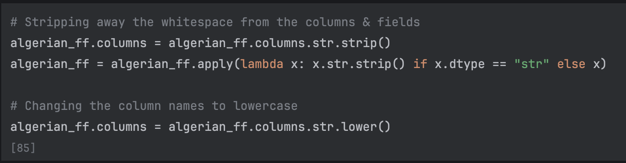
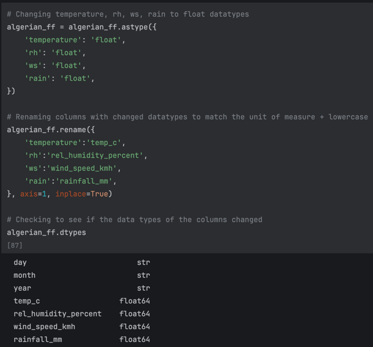
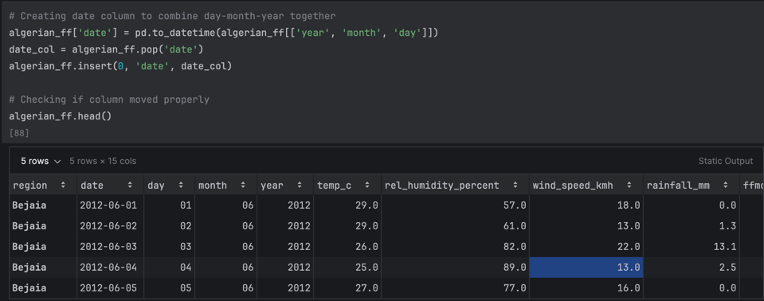
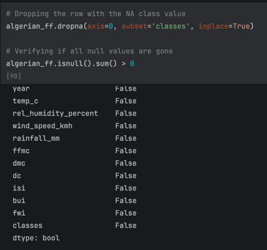

# CSCI-415 Project 1 - Weka
## Program Author: Sameer Ramkissoon
## Instructor: H. Gu

### Table Of Contents
<ol>
    <li>Describing the Dataset</li>
    <li>Cleaning & Preprocessing</li>
    <li>Converting to ARFF Weka Format</li>
    <li>Converting to Arff</li>
</ol>

### Describing the Dataset
**Dataset Name:** Algerian Forest Fires

**Dataset Link:** https://archive.ics.uci.edu/dataset/547/algerian+forest+fires+dataset

**Dataset Authors:** Faroudja Abid, Nouma Izeboudjen

The original dataset, located at the following path **data/Algerian_forest_fires_dataset_UPDATE.csv**, was developed for the
purpose of predicting forest fires in Algeria. The two authors listed above created it to perform a case study on the decision
tree algorithm. There are **244 instances of data and 14 features/attributes**. Additionally, the original data is
**SPLIT** between two regions: Bejaia and Sidi-Bel Abbes. Below is a look at how the original data is formatted.

**Figure 1:** The head of the Bejaia region data

**Figure 2:** The head of the Sidi-Bel Abbes region data. Note that the dataset contained **BOTH** separated by a blank row

### Cleaning & Preprocessing
<ol>
    <li>Combining Regions</li>
    <li>Fix Column & Cell Formatting</li>
    <li>New Columns & Removing Rows</li>
</ol>

#### Combining Regions
As stated prior, the original dataset contains data from two different regions. It would be nice to combine both into one
complete dataset and have their index be the region name(s). The dataset was split into two using the **.iloc[]** method from the
Python Pandas package. Each mini set was given a new region column which was set as the index. Makes it easier to look for
which region I want.

**Figure 3:** Concatenating mini sets bejaia_df & sidi_bel_abbes_df into one full DataFrame (algerian_ff)

**Figure 4:** First few rows of the Sidi-Bel Abbes region from the newly made dataset

#### Fix Column & Cell Formatting
The Excel preview of the CSV earlier showcased visible whitespace for some column names (EX: ' Ws') and cell values (EX: 'not fire   ').
This whitespace was stripped away before all the column names were converted to lowercase; it provides better readability overall.

**Figure 5:** Code to format columns and cells

The values for the attributes were also strings. Although this is applicable to some, the temperature, rh (relative humidity), ws (wind speed), and rain
should be float values. These specific column names were also changed to include their unit of measurement. The code below converted these columns 
to be floats instead of strings. The *temperature* column, for example, is now called **temp_c** to indicate it is the temperature in Celsius.

**Figure 6:** Changing the column data types and names for temperature, rh, ws, and rain

#### New Columns & Removing Rows
A column that looked necessary to add was a date column. Each row contained the date split into day, month, and year already so they were
not removed from the table. No other columns needed to be created for this dataset. Additionally, the date was moved to be the first column of the dataset.

**Figure 7:** Creating the new date column and moving it to the front

After this, the dataset was checked to verify there were no null values present. There only appeared to be one located in the classes attribute.
This row was removed since it was only one instance and would not heavily alter the data.

**Figure 8:** Removing nulls with subset classes attribute and verifying no more nulls