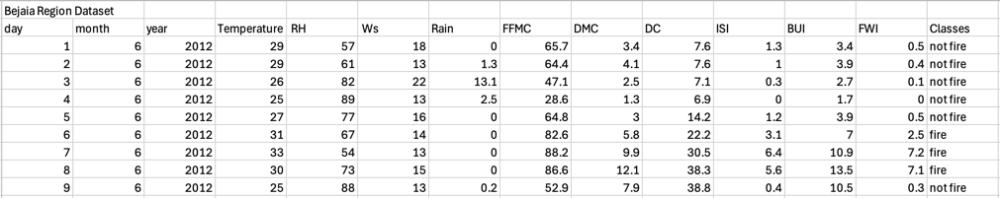
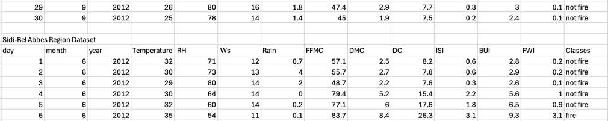
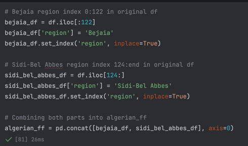
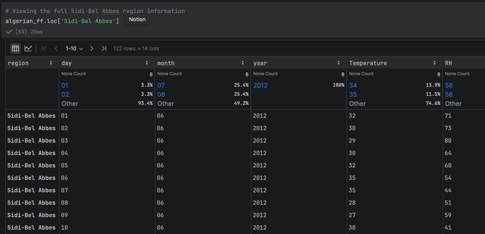

# CSCI-415 Project 1 - Weka
## Program Author: Sameer Ramkissoon
## Instructor: H. Gu

### Table Of Contents
<ol>
    <li>Describing the Dataset</li>
    <li>Cleaning & Preprocessing</li>
    <li>Converting to ARFF Weka Format</li>
</ol>

### Describing the Dataset
**Dataset Name:** Algerian Forest Fires

**Dataset Link:** https://archive.ics.uci.edu/dataset/547/algerian+forest+fires+dataset

**Dataset Authors:** Faroudja Abid, Nouma Izeboudjen

The original dataset, located at the following path **data/Algerian_forest_fires_dataset_UPDATE.csv**, was developed for the
purpose of predicting forest fires in Algeria. The two authors listed above created it to perform a case study on the decision
tree algorithm. There are **244 instances of data and 14 features/attributes**. Additionally, the original data is
**SPLIT** between two regions: Bejaia and Sidi-Bel Abbes. Below is a look at how the original data is formatted.

**Figure 1:** The head of the Bejaia region data

**Figure 2:** The head of the Sidi-Bel Abbes region data. Note that the dataset contained **BOTH** separated by a blank row

### Cleaning & Preprocessing
<ol>
    <li>Combining Regions</li>
    <li>Removing whitespace and fix column formatting</li>
    <li>Create new column(s) and remove rows with null classes</li>
</ol>

#### Combining Regions
As stated prior, the original dataset contains data from two different regions. It would be nice to combine both into one
complete dataset and have their index be the region name(s). The dataset was split into two using the **.iloc[]** method from the
Python Pandas package. Each mini set was given a new region column which was set as the index. Makes it easier to look for
which region I want.

**Figure 3:** Method to concatenate mini sets into one full DataFrame

**Figure 4:** First few rows of the Sidi-Bel Abbes region from the newly made dataset